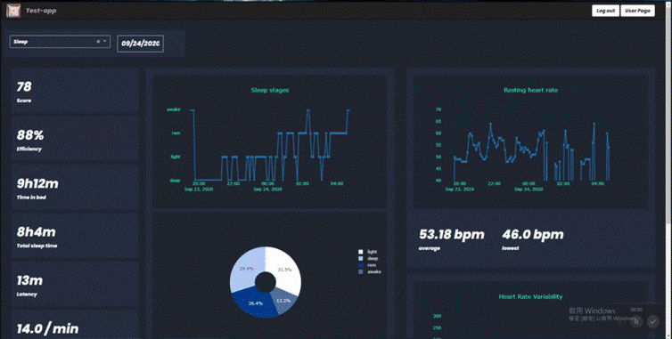

# Oura ring user dashboard website
## About The Project
A user friendly third-party web helps visualize oura users’ data.<br>
First, you need to sign up

<br>Second, you can login with your account

<br> As long as you login and authorize with your oura account, user page will show your personal data


<br> Dashboard


## Getting Started
### prerequisites
* PostgreSQL
> Build up PostgreSQL on your machine
* Create credentials/
    * db_credentials.json
    >  { <br>"DB_NAME" : "YOUR_DB_NAME",<br>
        "DB_USER" : "YOUR_DB_USER_NAME", <br>
        "DB_HOST" : "YOUR_DB_HOST_NAME", <br>
        "DB_PASS" : "YOUR_DB_PASSWORD", <br>
        "DB_PORT" : "YOUR_DB_PORT"<br>}
    * oura_app_credentials.json
    > {<br>"CLIENT_ID" : "YOUR_APP_CLIENT_ID( request from oura )",<br>
    "CLIENT_SECRET" : "YOUR_APP_CLIENT_SECRET( request from oura )"<br>
    }
    * postgres_info.json
    > {<br>"db_url":"YOUR_POSTGRESQL_URL"<br>}
* Installation
    * python packages
    ```sh
    pip install -r requirement.txt
    ```
### Running
```sh
python wsgi.py
```
App will running at port 9527
## Directory Structure

    /oura_testing
    |--- /project
    |    |--- /credentials (hiden)
    |    |--- /static
    |    |--- /templates
    |    |--- /dash
    |    |    |--- dashboard.py
    |    |--- __init__.py
    |    |--- model.py
    |    |--- Register.py
    |    |--- routes.py
    |    |--- token_saver.py
    |    |--- update_to_db.py
    |--- config.py
    |--- requirement.txt
    |--- wsgi.py

### `config.py`
> 配置資料庫相關設定，web's secret key等

### `requirement.txt`
> python所需之packages <br> 在python環境上執行 `pip install -r requirement.txt`

### `wsgi.py`
> 執行檔 <br> 在此檔案的目錄層執行 `python wsgi.py`

### project/
#### credentials/ (依照local環境更改)
> 含有<br> db_credential.json 存放 database 設定 <br> oura_app_credentials.json 存放 app 設定 <br>
postgres_info.json 存放 postgresql url
#### static/
> 含有 css 和其他靜態資源

#### templates/
> 存放 Html 檔
#### dash/
> `dashboard.py`<br> dashboard 呈現的程式碼
#### `__init__.py`
> App 的初始化
#### `model.py`
> 利用 Sqlalchemy 來建立後端和資料庫的溝通
#### `Register.py`
> 利用 flask_wtf 來建立Login Signup表單
#### `routes.py`
> App 的各路徑
#### `token_saver.py`
> 更新 儲存 Oauth2.0 token 進資料庫
#### `update_to_db.py`
> 更新 儲存資料進資料庫